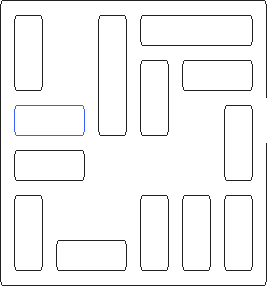

# Projet Rush Hour

Le but de ce projet est d'écrire un programme permettant de trouver une
solution au jeu *Rush Hour*.

## Règles du jeu

Le jeu Rush Hour se joue seul sur une grille carrée de six cases de côté. Sur
cette grille sont répartis des véhicules d'une case de largeur, et de deux ou
trois cases de longueur. Ces véhicules peuvent être placés horizontalement ou
verticalement. Chaque véhicule peut être déplacé en avant ou en arrière, mais
pas latéralement, tant qu'il n'entre pas en collision avec un autre véhicule.
Le but du jeu est de faire sortir l'un des véhicules par une sortie placée sur
le bord du plateau. L'image ci dessous illustre un exemple de partie.

Chaque déplacement de véhicule compte pour un coup, quelle que soit la longueur
du déplacement. La qualité de votre solution dépend donc du nombre de coups
nécessaires depuis la situation initiale pour faire sortir le véhicule.

## Principe

Pour résoudre le jeu *Rush Hour* nous avons décidé d'implementer dans notre programme un algorithme de parcours en largeur (BFS). Grâce à cette algorithme, nous sommes capables de générer toutes les grilles (situation de jeu) possibles à partir d'une grille initiale. Pour trouver le plus court chemin, nous avons décidé d'arrêter le parcours dès qu'une grille gagnante apparaît. 

Dans notre classe Solver nous avons créé une fonction *solve()* qui va à partir d'une grille initial stockée sur queue (FIFO) vérifié à chaque itération si notre première grille dans la queue existre déjà dans notre tableau dynamique (vector) de grille, si c'est le cas, on passe à l'itération suivante. Sinon, on génére tous les voisins possibles et on retire notre grille courante de la queue et on l'ajoute dans notre tableau dynamique et puis pour chaque voisin généré, on vérifie aussi si cette nouvelle grille est dans notre tableau dynamique et notre queue pour éviter les doublons et pour optimiser notre algorithme. Pour parcourir nos grilles nous avons stocké pour chaque grille voisine généré le parent pour qu'on puisse trouver le plus court chemin possible. En premier temps, nous avons comparé la grille courante à toutes les grilles avec un *operator==* et notre solveur mettait environ 2 minutes et 40 secondes pour résoudre la grille du Puzzle donné. Nous avons donc décidé d'optimiser l'algorithme en transformant les grilles à des strings qu'on peut comparer beaucoup plus rapidement et notre solveur met maintenant environ 1 à 2 secondes pour résoudre le Puzzle.

Pour affichier les différentes étapes de résolution, nous avons transformer nos grilles à des images SVG pour mieux visualiser les déplacements. Nous avons aussi décidé d'utiliser SDL Pour mieux facilier la visualisation des étapes de résolution. En plus, on peut généré des grilles aléatoires et les résoudre avec notre solveur.

Pour généré des grilles aléatoires, nous avons choisi un nombre aléatoire de voiture à mettre sur la grille, nous avons choisi aussi aléatoirement les positions, la taille et la direction de chaque voiture. L'algorithme tourne en boucle pour placer le nombre de voitures donné. 

## Compilation 

Tout d'abord, il faut créer les dossiers bin, obj et images_svg pour stocker le fichier exécutable, les fichiers objets et les images SVG générés. Ensuite tout simplement taper sur votre terminal Linux la commande *make* qui va vous compiler notre code. 

Nous avons deux main, *rushHour_console* et *rushHour_SDL*. La première main nous permet de debuger notre code dans la console et on ne génére qu'une seule grille à la fois dans le block *PUZZLE_TEST*. Quand vous tester le block *PUZZLE_TEST* veuillez ajouter un argument, c'est le nombre de coup minimum que vous pouvez avoir pour résoudre la grille (nous recommendons 3 comme nombre de coups minimum). Pour les autres blocks de test vous n'avez pas besoin d'ajouter un argument pour compiler *rushHour_console*. La deuxième main nous permet de faire un affichage graphique à l'aide de SDL et d'afficher tout d'abord la solution du Puzzle et d'ensuite génénré des grilles aléatoires et visualiser leurs résolution.

## SDL

Si vous n'avez pas SDL installé sur votre machine, veuillez copier coller la commande suivante pour installer les packages nécessaires pour compiler notre code.

*sudo apt-get install libsdl2-dev libsdl2-image-dev libsdl2-ttf-dev libsdl2-mixer-dev*

Sur la fenêtre SDL, 
- Taper sur flèche de droite pour afficher l'image suivante. 
- Taper sur la flèche de gauche pour afficher l'image précedente.
- Taper sur la flèche de haut pour généré une nouvelle grille qui peut se résoudre en respectant nos contraintes.

## Contraintes

- Nous avons remarqué que pour résoudre Puzzle, nous avons au maximum environ 160 grilles à decouvrir sur notre queue. Nous avons donc mis en place une contrainte qui relance la résolution d'une nouvelles grille aléatoire quand on dépasse 200 grilles à decouvrir.

- Il est aussi possible de modifer sur le main le nombre de voitures minimum et maximum à générer sur une grille de taille 6 x 6. Pour une grille de cette taille on recommande entre 6 et 13 voitures. Sinon, on risque d'avoir un bug où on ne peut pas placer toutes les voitures sur la grille car il n'y a pas assez de places vides.

##  Améliorations possible

Afin d'optimiser la vitesse de la fonction solve(), nous avons pensé à utiliser des threads, mais nous n'avons pas eu le temps de s'y pencher vraiment.
Utiliser une hashmap à la place d'un vecteur de Grid* pour coveredGrids (dans la classe Solver) serait bien plus rapide, complexité O(1) pour rechercher un élément.
Générer des grilles solvables prend du temps car actuellement on se base sur l'aléatoire pour créer une grille, il vaudrait mieux créer une grille en partant d'une solution gagnante et remonter ensuite.

##  Problèmes connus

Nous avons essayé de faire au mieux possible la gestion mémoire de SDL (notemment en utilisant le code du module Image de LIFAP4 pour la gestion des Images/SDL), mais il se peut que valgrind détecte quelques erreurs mémoires des fois.
Il arrive que le programme plante, il faut donc fermer le terminal qui a lancé le programme et le réouvrir pour fermer la fenêtre SDL
